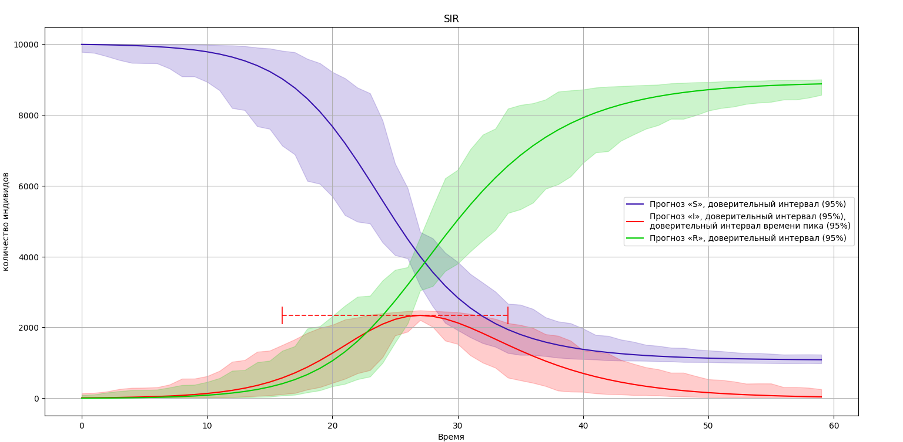

# Package emodel

A package for epidemiological modeling based on a compartmental approach.

## Import package

```python
import emodel
```

## Сreating a simple SIR model

```python
from emodel import EpidemicModel, Stage, Factor, Flow
from matplotlib import pyplot as plt

s = Stage('S', 99)
i = Stage('I', 1)
r = Stage('R', 0)

beta = Factor(0.4, name='beta')
gama = Factor(0.1, name='gama')

s_i = Flow(s, i, beta, inducing_factors=i)
i_r = Flow(i, r, gama)

sir_model = EpidemicModel((s, i, r), (s_i, i_r))
result_df = sir_model.start(70)

result_df.plot(title='SIR', ylabel='population', xlabel='time')
plt.show()
```



## Load a model from json.

```python
m = EpidemicModel.from_json(json_content, struct_version='kk_2024')
```

`'kk_2024'` - model description protocol (Kireev-Kuldarev-2024)

Getting results. The start method, which takes the simulation duration, returns a pandas.DataFrame with the simulation results.

```python
result = m.start(100)
```

An example of a modeling function from a file with a json structure and saving the results to a csv table.

```python
def modelling_from_json(filename_json: str, filename_csv: str, time: int):
	with open(filename_json, encoding='utf8') as file:
		json_content = file.read()
		e_model = EpidemicModel.from_json(json_content, struct_version='kk_2024')
		result = e_model.start(time)
		result.to_csv(filename_csv, sep=',')
```